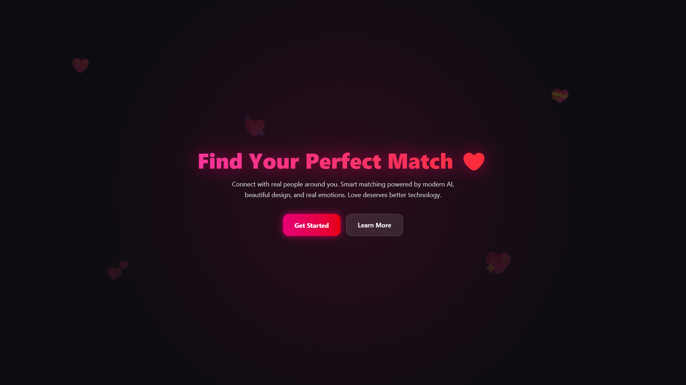
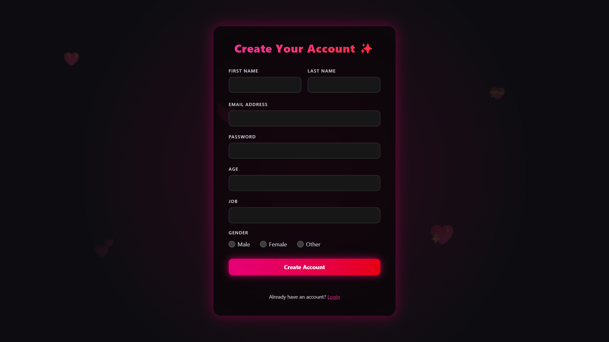
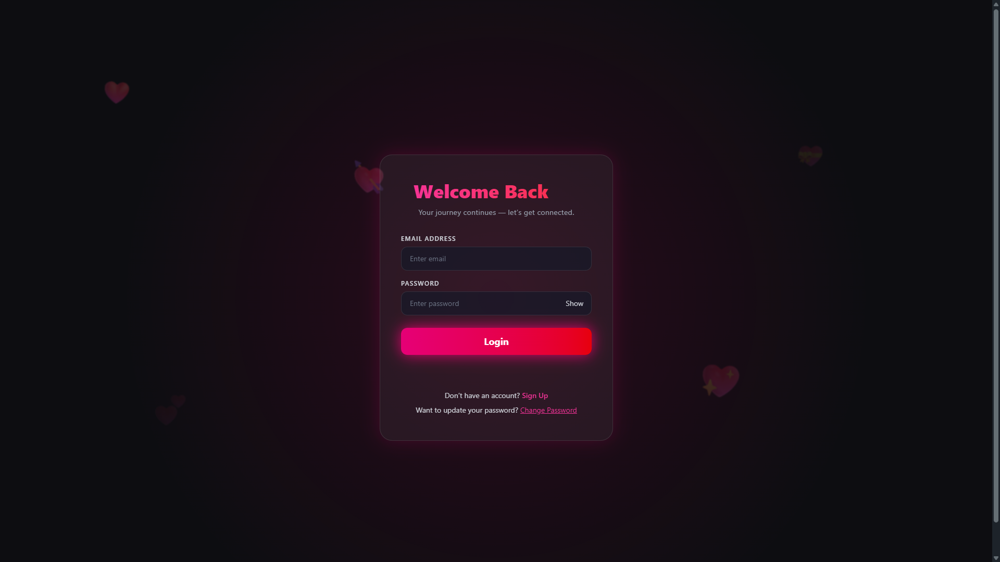
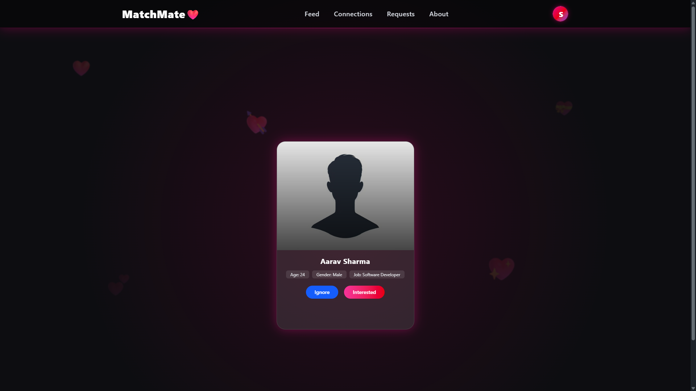

<div align="center">

# 🚀 **MatchMate – Frontend (React + Vite)**

Modern UI for building real social connections.

A fast, clean, and optimized frontend for the MatchMate platform — built with React, Tailwind, Zustand & Vite.  
Future updates will include messaging, notifications, and real-time features.

<br/>

### 🏅 Tech Stack


<br/>
</div>

---

## 🔐 **Authentication**

- Signup / Login / Logout
- JWT-based authentication
- Secure **HTTP-only cookies**
- Password hashing (via backend)
- Auto-persisted login state

---

## 👥 **Connection System**

- Browse all users
- Send connection requests
- Accept / Ignore requests
- Manage **pending & received** requests
- Smooth realtime-like UI via Zustand

---

## 👤 **User Profile**

- Edit profile information
- View basic user details
- Fully responsive layout
- Reusable components

---

## ⚡ **Performance**

- Optimized global state
- Lean API calls with Axios
- Fast routing via React Router
- Minimal re-renders
- Tailwind CSS utility-first styling

---

## 🧱 **Project Structure**

matchmate-frontend/
src/
assets/ (images, icons, previews)

    components/                  (reusable UI components)
      About.jsx
      BackgroundParticles.jsx
      Body.jsx
      ChangePassword.jsx
      Connections.jsx
      Dashboard.jsx
      DropdownPortal.jsx
      EditProfile.jsx
      Feed.jsx
      Footer.jsx
      Home.jsx
      Login.jsx
      Messages.jsx
      Navbar.jsx
      Profile.jsx
      Requests.jsx
      SignUp.jsx
      UserCard.jsx

    hooks/                       (custom React hooks)

    store/                       (Zustand stores)
      useAuthStore.js
      useConnectionStore.js
      useFeedStore.js
      usePending.js

    utils/
      constants.js               (base URLs & constants)

    app.css
    App.jsx                      (app + routes)
    main.jsx                     (Vite entry point)

.env (environment variables)
index.html
eslint.config.js
vite.config.js
vercel.json
package.json
package-lock.json

🔗 Live Demo

👉 https://matchmate-frontend.vercel.app

🔌 Backend API Repository

👉 https://github.com/yourusername/matchmate-backend

## ❌ How It Works – Architecture

```txt
Frontend (React + Zustand + Axios)
    |
    |  HTTP (JWT, Cookies)
    v
Backend (Node.js + Express + MongoDB)
    |
    |  Mongoose Models
    v
Database (MongoDB Atlas)
```

- Frontend handles all UI + state.
- Backend handles auth, connections, secure cookies, hashing.
- Both communicate via REST APIs.

## 🧱 **📸 Screenshots**






